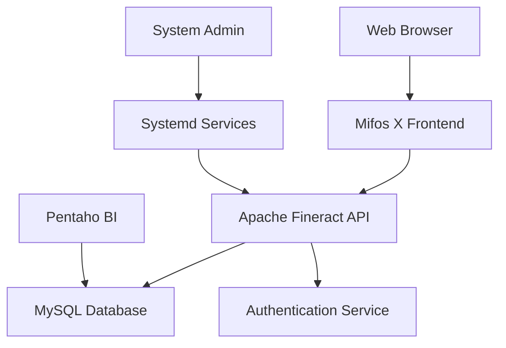

# 🏦 Mifos X Platform - Production Ready Financial Services Application

<div align="center">


*A comprehensive financial services platform combining Apache Fineract backend with modern Angular frontend*

</div>

---

## 📋 Table of Contents

- [🎯 Overview](#-overview)
- [🏗️ Architecture](#️-architecture)
- [⚡ Quick Start](#-quick-start)
- [🔧 Backend Setup (Apache Fineract)](#-backend-setup-apache-fineract)
- [🎨 Frontend Setup (Mifos X Web App)](#-frontend-setup-mifos-x-web-app)
- [📊 Business Intelligence Setup](#-business-intelligence-setup)
- [🚀 Production Deployment](#-production-deployment)
- [🔐 Security Configuration](#-security-configuration)
- [📈 Monitoring & Analytics](#-monitoring--analytics)
- [🛠️ Development](#-development)
- [🤝 Contributing](#-contributing)

---

## 🎯 Overview

This is a full-stack financial services platform built with:

- **Backend**: Apache Fineract - Core banking and financial services API
- **Frontend**: Mifos X Web Application - Modern Angular-based user interface
- **Analytics**: Pentaho Community Edition - Business Intelligence and reporting

### ✨ Key Features

- 🏦 **Core Banking**: Loans, savings, deposits, and payment processing
- 👥 **Client Management**: Individual and group client management
- 📊 **Reporting**: Comprehensive financial reporting and analytics
- 🔐 **Security**: Multi-tenant architecture with OAuth2 support
- 🌐 **Multi-language**: Support for multiple languages and locales
- 📱 **Responsive**: Mobile-first design approach

---

## 🏗️ Architecture



**Technology Stack:**
- **Frontend**: Angular 16+, TypeScript, Tailwind CSS
- **Backend**: Java 17+, Spring Boot, Gradle
- **Database**: MySQL 8.0+
- **Analytics**: Pentaho Community Edition
- **Deployment**: Systemd, Docker (optional)

## ⚡ Quick Start Commands

Once everything is set up, use these commands to start the application:

### Backend (Terminal 1)
```bash
cd fineract
java -jar fineract-provider/build/libs/fineract-provider.jar
```

### Frontend (Terminal 2)
```bash
cd fineract-frontend
ng serve --proxy-config proxy.conf.js --open
```

**Access Points:**
- Frontend: `http://localhost:4200`
- Backend API: `https://localhost:8443`
- Login: `mifos` / `password`

---

## 🚀 Automated Setup (Recommended)

For a quick automated setup, use the provided setup script:

```bash
# Make the script executable
chmod +x setup.sh

# Run the automated setup
./setup.sh
```

This script will:
- ✅ Check all prerequisites (Java 17+, MySQL 8.0+, Node.js 18+)
- ✅ Create required databases (`fineract_tenants`, `fineract_default`)
- ✅ Generate SSL certificate
- ✅ Build the backend JAR file
- ✅ Install frontend dependencies
- ✅ Configure environment files

**Note:** The script will prompt for your MySQL root password (press Enter if no password).

---

## 📋 Manual Setup (Alternative)

### Prerequisites

Ensure you have the following installed:

```bash
# Required versions
- Java 17+
- Node.js 18+
- MySQL 8.0+
- Git
```

### System Requirements

| Component | Minimum | Recommended |
|-----------|---------|-------------|
| RAM | 4GB | 8GB+ |
| Storage | 20GB | 100GB+ |
| CPU | 2 cores | 4+ cores |

---

## 🔧 Backend Setup (Apache Fineract)

### 1. Clone Repository

```bash
git clone https://github.com/apache/fineract.git
cd fineract
```

### 2. Set Permissions

```bash
sudo chmod -R 777 fineract/
```

### 3. Database Setup

**Create Required Databases:**
```bash
# Connect to MySQL
mysql -u root

# Create databases
CREATE DATABASE fineract_tenants;
CREATE DATABASE fineract_default;
```

**Configure Database Connection:**
Edit the configuration file:
```bash
nano fineract-provider/src/main/resources/application.properties
```

**MySQL Configuration (Updated for working setup), Don't forget to use your own configuration that suits your own setup:**
```properties
# Database Configuration
spring.datasource.hikari.driverClassName=com.mysql.cj.jdbc.Driver
spring.datasource.hikari.jdbcUrl=jdbc:mysql://localhost:3306/fineract_tenants
spring.datasource.hikari.username=root
spring.datasource.hikari.password=

# Connection Pool Settings
spring.datasource.hikari.minimumIdle=3
spring.datasource.hikari.maximumPoolSize=10
spring.datasource.hikari.idleTimeout=60000
spring.datasource.hikari.connectionTimeout=20000
spring.datasource.hikari.leakDetectionThreshold=60000

# SSL Configuration
server.ssl.enabled=true
server.port=8443
server.ssl.key-store=classpath:keystore.jks
server.ssl.key-store-password=openmf
server.ssl.key-store-type=JKS
```

### 4. Generate SSL Certificate

**Create SSL Keystore (Required for HTTPS):**
```bash
# Generate self-signed certificate
keytool -genkey -alias fineract -keyalg RSA -keystore fineract-provider/src/main/resources/keystore.jks -keysize 2048 -storepass openmf -keypass openmf

# When prompted, enter:
# - First and last name: localhost
# - Organizational unit: Development
# - Organization: Fineract
# - City: Your City
# - State: Your State
# - Country code: US
```

### 5. Build Application

```bash
# Clean and build
./gradlew clean bootJar

# The JAR file will be generated at:
# fineract-provider/build/libs/fineract-provider-0.1.0-SNAPSHOT.jar
```

### 6. Run Application

```bash
# Start backend
java -jar fineract-provider/build/libs/fineract-provider.jar

# The application will start on HTTPS port 8443
# Wait for "Started ProviderApplication" message
```

**🌐 Backend Access:** `https://localhost:8443`

**Default Login Credentials:**
- Username: `mifos`
- Password: `password`

---

## 🎨 Frontend Setup (Mifos X Web App)

### 1. Navigate to Frontend Directory

```bash
cd fineract-frontend
```

### 2. Install Dependencies

```bash
# Install Node modules
npm install

# Install Angular CLI globally (use Node.js 18)
nvm use 18
npm install -g @angular/cli@15.2.11
```

### 3. Environment Configuration

**Create runtime environment file:**
```bash
# Copy template
cp src/assets/env.template.js src/assets/env.js
```

**Edit `src/assets/env.js`:**
```javascript
window['env'] = window['env'] || {};
window['env']['oauthServerEnabled'] = false;
window['env']['minPasswordLength'] = '1';
window['env']['fineractApiUrls'] = 'http://localhost:4200';
window['env']['fineractApiUrl'] = 'http://localhost:4200';
window['env']['apiProvider'] = '/api';
```

**Edit `src/environments/environment.ts`:**
```typescript
export const environment = {
  production: false,
  baseApiUrl: 'http://localhost:4200',
  apiProvider: '/api',
  minPasswordLength: 1
};
```

### 4. Proxy Configuration

**Create `proxy.conf.js`:**
```javascript
const PROXY_CONFIG = [
  {
    context: ['/api'],
    target: 'https://localhost:8443',
    secure: false,
    changeOrigin: true,
    pathRewrite: {
      '^/api': '/fineract-provider/api'
    }
  },
  {
    context: ['/fineract-provider'],
    target: 'https://localhost:8443',
    secure: false,
    changeOrigin: true,
    logLevel: 'debug'
  }
];

module.exports = PROXY_CONFIG;
```

### 5. Development Server

```bash
# Start frontend with proxy configuration
ng serve --proxy-config proxy.conf.js --open
```

**🌐 Frontend Access:** `http://localhost:4200`

### 6. Production Build

```bash
# Build for production
ng build --configuration production

# Output directory: dist/
```

---

## 📊 Business Intelligence Setup

### Pentaho Community Edition

```bash
# Download Pentaho CE
wget https://sourceforge.net/projects/pentaho/files/Business%20Intelligence%20Server/9.4/pentaho-server-ce-9.4.0.0-343.zip

# Extract and configure
unzip pentaho-server-ce-9.4.0.0-343.zip
cd pentaho-server/

# Configure database connection
# Edit: pentaho-solutions/system/applicationContext-spring-security-hibernate.properties
```

**Key Features:**
- 📈 **Dashboards**: Interactive financial dashboards
- 📊 **Reports**: Automated report generation
- 🔍 **Data Mining**: Advanced analytics capabilities
- 📋 **ETL**: Data transformation and loading

---

## 🚀 Production Deployment

### Backend Systemd Service

Create service file:
```bash
sudo nano /etc/systemd/system/fineract.service
```

```ini
[Unit]
Description=Apache Fineract Application
After=mysql.service
Wants=mysql.service

[Service]
Type=simple
User=fineract
Group=fineract
WorkingDirectory=/opt/fineract
ExecStart=/usr/bin/java -jar -Xms512m -Xmx2048m /opt/fineract/fineract-provider-0.1.0-SNAPSHOT.jar
ExecReload=/bin/kill -HUP $MAINPID
KillMode=process
Restart=on-failure
RestartSec=42s

Environment=JAVA_HOME=/usr/lib/jvm/java-17-openjdk
Environment=SPRING_PROFILES_ACTIVE=prod

StandardOutput=journal
StandardError=journal
SyslogIdentifier=fineract

[Install]
WantedBy=multi-user.target
```

**Start service:**
```bash
sudo systemctl daemon-reload
sudo systemctl enable fineract
sudo systemctl start fineract
sudo systemctl status fineract
```

### Frontend (Nginx)

```nginx
server {
    listen 80;
    server_name yourdomain.com;
    root /var/www/mifos-x/dist;
    index index.html;

    # Gzip compression
    gzip on;
    gzip_types text/css application/javascript application/json;

    # Handle Angular routing
    location / {
        try_files $uri $uri/ /index.html;
    }

    # API proxy
    location /fineract-provider/ {
        proxy_pass https://localhost:8443;
        proxy_ssl_verify off;
        proxy_set_header Host $host;
        proxy_set_header X-Real-IP $remote_addr;
    }

    # Security headers
    add_header X-Frame-Options "SAMEORIGIN" always;
    add_header X-Content-Type-Options "nosniff" always;
    add_header X-XSS-Protection "1; mode=block" always;
}
```

---

## 🔧 Troubleshooting

### Common Issues and Solutions

#### 1. **Gradle Wrapper Issues**
```bash
# If ./gradlew fails, regenerate the wrapper
gradle wrapper
```

#### 2. **MySQL Connection Issues**
- Ensure MySQL is running: `brew services start mysql` (macOS) or `sudo systemctl start mysql` (Linux)
- Verify databases exist: `mysql -u root -e "SHOW DATABASES;"`
- Check password is empty in `application.properties`

#### 3. **SSL Certificate Issues**
```bash
# If keystore.jks is missing, regenerate it
keytool -genkey -alias fineract -keyalg RSA -keystore fineract-provider/src/main/resources/keystore.jks -keysize 2048 -storepass openmf -keypass openmf
```

#### 4. **Frontend Proxy Issues**
- Ensure backend is running on `https://localhost:8443`
- Check `proxy.conf.js` configuration
- Verify `env.js` file exists in `src/assets/`

#### 5. **Node.js Version Issues**
```bash
# Use Node.js 18 (required for this setup)
nvm use 18
nvm alias default 18
```

#### 6. **Database Migration Errors**
- Drop and recreate databases if migration fails:
```sql
DROP DATABASE IF EXISTS fineract_tenants;
DROP DATABASE IF EXISTS fineract_default;
CREATE DATABASE fineract_tenants;
CREATE DATABASE fineract_default;
```

---

### Production Security Settings

**Backend (application.properties):**
```properties
# Security
management.endpoint.health.show-details=never
management.endpoints.web.exposure.include=health,info
server.error.include-stacktrace=never

# SSL/TLS
server.ssl.key-store=/opt/fineract/keystore.p12
server.ssl.key-store-password=changeit
server.ssl.key-store-type=PKCS12

# CORS
fineract.cors.enabled=true
fineract.cors.allowed-origins=https://yourdomain.com
```

### Default Credentials

**Development Environment:**
- **Username:** `mifos`
- **Password:** `password`

> ⚠️ **Important**: Change default credentials in production!

---

## 📈 Monitoring & Analytics

### Health Checks

```bash
# Backend health
curl -k https://localhost:8443/fineract-provider/api/v1/health

# Frontend status
curl http://localhost:4200/health
```

### Logging

**Backend logs:**
```bash
# System logs
sudo journalctl -u fineract -f

# Application logs
tail -f /opt/fineract/logs/fineract.log
```

### Performance Monitoring

- **JVM Metrics**: Use JProfiler or similar tools
- **Database**: MySQL Performance Schema
- **Web**: Google Lighthouse for frontend performance

---

## 🛠️ Development

### Development Workflow

1. **Backend Development:**
   ```bash
   ./gradlew bootRun --args='--spring.profiles.active=dev'
   ```

2. **Frontend Development:**
   ```bash
   ng serve --configuration=development
   ```

3. **Database Changes:**
   ```bash
   # Run migrations
   ./gradlew flywayMigrate
   ```

### Testing

```bash
# Backend tests
./gradlew test

# Frontend tests
ng test
ng e2e

# Integration tests
./gradlew integrationTest
```

### API Documentation

- **Swagger UI**: `https://localhost:8443/fineract-provider/swagger-ui/index.html`

---

## 🤝 Contributing

### Development Setup

1. Fork the repositories
2. Create feature branches
3. Make changes with tests
4. Submit pull requests

### Code Standards

- **Backend**: Google Java Style Guide
- **Frontend**: Angular Style Guide
- **Commits**: Conventional Commits

### Community

- **Mailing List**: dev@fineract.apache.org
- **Slack**: [Join Community](https://mifos-community.slack.com)
- **Issues**: GitHub Issues for bug reports

---

## 📞 Support

### Documentation
- [Apache Fineract Docs](https://fineract.apache.org)
- [Mifos Community](https://mifos.org)

### Professional Support
For enterprise support and customization, contact the Mifos community.

---

<div align="center">

**Made with ❤️ by the Mifos Community**

[](https://opensource.org/licenses/Apache-2.0)
[](https://mifos.org)

</div>
